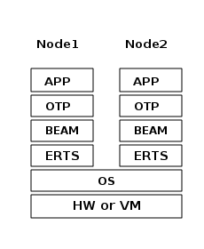
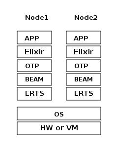
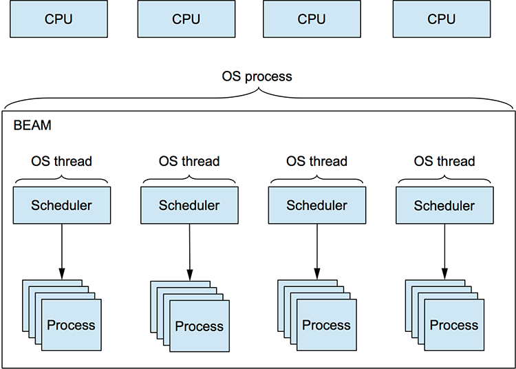
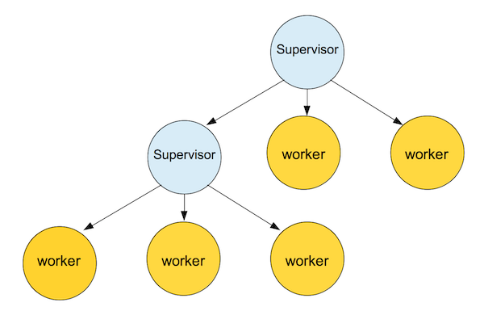

!header Programación Funcional con Erlang
!footer Fiqus - Cooperativa de Software
!custom_css erlang_es.css

!slide_classes intro-slide
# Programación Funcional con Erlang!
<br />

<br />

[https://github.com/fiqus/fp-beam-talk/](https://github.com/fiqus/fp-beam-talk/)
<br />
Pablo Brudnick :: pbrudnick@fiqus.coop :: [@pablobrud](https://twitter.com/pablobrud)

---

# La BEAM
BEAM es la Máquina Virtual de Erlang, parte del Erlang Run-Time System (ERTS), que compila código Erlang a bytecode (archivos `.beam`), los cuales son ejecutados en la BEAM.

## Erlang
Es un lenguaje funcional concurrente, distribuido y tolerante a fallas que fue creado por Sony Ericsson en la década del 80.

## OTP
Es un set de librerías que vienen con Erlang que proveen abstracciones y middle-ware para construir aplicaciones.

---
# Erlang Run-Time System (ERTS)



Y con Elixir...


---

# Actor model
Erlang esta basado en el Actor Model, donde..
<br />
Actores (procesos) <-> Mensajes (mailboxes)
<br />
> The Erlang view of the world is that everything is a process and that processes can interact only by exchanging messages. (Joe Armstrong, uno de los creadores de Erlang)

## Procesos 

* Isolados unos de otros, se ejecutan **concurrentemente** y se comunican mediante mensajes
* Los procesos de la BEAM **NO SON** procesos del sistema operativo
* Extremadamente livianos
* Podemos tener cientos de miles corriendo simultaneamente (limite aprox 130 millones)

---

# Arquitectura de la BEAM

<br />


---

# Concurrencia

La forma básica de iniciar un proceso en Erlang:

```erlang
...
Pid = spawn(
    fun ->
          %% Código a ser ejecutado en el nuevo proceso
    end
)
...
```

## Comunicacion entre procesos

```erlang
%% Send a message signal to `Pid` with ping
Pid ! {self(), ping}.
```

```erlang
%% Receive a message
receive
    {Sender, ping} ->
        Sender ! pong
end.
```

---

# Hagamos un universal server!

```erlang
universal_server() ->
    receive
        {become, F} ->
            F()
    end.

factorial_server() ->
    receive
        {From, N} ->
            From ! factorial(N),
            factorial_server()
    end.


factorial(0) -> 1;
factorial(N) -> N * factorial(N-1).

test() ->
    Pid = spawn(fun universal_server/0),
    Pid ! {become, fun factorial_server/0},
    Pid ! {self(), 50},
    receive
        X -> X
    end.
```

---

# Arbol de Supervisión (Supervision Tree)
* Supervisors
* Workers



**Todos son procesos!**

El **Supervisor** es el responsable de iniciar, detener y monitorear sus procesos hijos.
Todo esto esta definidio en la **child specification**, los procesos hijos son iniciados en el orden especificado en dicha lista y terminados en el orden reverso.

📖 https://www.erlang.org/doc/design_principles/sup_princ.html

---

# Tolerancia a fallos
> Let it crash

> "things will go wrong in production" (annonymous)
<br /> 
La BEAM provée diferentes **estrategias** de supervision que definen **CÓMO** reiniciar procesos cuando éstos terminan:

* `one_for_one` - Si un proceso hijo termina, solo ese proceso es reiniciado.

* `one_for_all` - Si un proceso hijo termina, todos los otros son terminados y entonces todos los procesos hijos (incluido el que terminó) es reiniciado.

* `rest_for_one` - Si un proceso hijo termina, éste y el resto de los hijos **iniciados despues que dicho proceso**, son terminados y reiniciados.
---

# Abstracciones de Erlang/OTP

* application
* supervisor
* gen_server
* gen_event
* behaviours
* ETS
* Mnesia
* Umbrella apps
* ..etc

---

# Distribuido

```
$ erl -sname server -setcookie oh
Erlang/OTP 22 [erts-10.7] [source] [64-bit] [smp:8:8] [ds:8:8:10] [async-threads:1] [hipe]

Eshell V10.7  (abort with ^G)
(server@PABLO-BRUDNICK)1> 
```

```
> erl -sname client -setcookie oh
Erlang/OTP 22 [erts-10.7] [source] [64-bit] [smp:8:8] [ds:8:8:10] [async-threads:1] [hipe]

Eshell V10.7  (abort with ^G)
(client@PABLO-BRUDNICK)1> net_adm:ping('server@PABLO-BRUDNICK').
pong
(client@PABLO-BRUDNICK)2> spawn('server@PABLO-BRUDNICK', erlang, list_to_binary, [["a"]]).
<8725.90.0>
```

📖 https://www.erlang.org/doc/reference_manual/distributed.html

🔎 "Investigating the Scalability Limits of Distributed Erlang" (https://www.dcs.gla.ac.uk/~amirg/publications/DE-Bench.pdf)

---

# Probemos algunos comandos ao vivo

- `observer:start/0`
- `spawn/2`
- `erlang:processes/0`
- `erlang:process_info/2` (con `reductions`, `current_stacktrace`)

## Libs interesantes
- https://github.com/massemanet/redbug
- https://github.com/AdRoll/rebar3_hank
- https://github.com/AdRoll/rebar3_format
- http://ferd.github.io/recon/

---

# Rebar3

Es una herramienta de Erlang para facilitar la creación, desarrollo y release de librerías y aplicaciones.

- Manejo de dependencias
- Documentación (Edoc)
- Plugins
- Tests
- Dialyzer
- Releases
- Xref

```
$ rebar3 new app myapp
===> Writing myapp/src/myapp_app.erl
===> Writing myapp/src/myapp_sup.erl
===> Writing myapp/src/myapp.app.src
===> Writing myapp/rebar.config
===> Writing myapp/.gitignore
===> Writing myapp/LICENSE
===> Writing myapp/README.md
```

🔎 https://www.rebar3.org/
---

# Fuentes

* https://www.erlang.org/doc/index.html
* https://joearms.github.io/published/2013-11-21-My-favorite-erlang-program.html
* https://www.youtube.com/watch?v=JvBT4XBdoUE


---

# Muchas gracias! 👋
